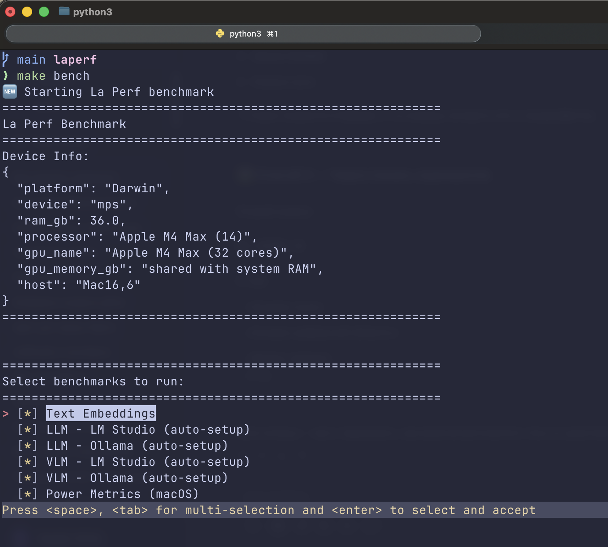

<div align="center">

# La Perf
[](https://developer.nvidia.com/cuda-zone)
[](https://developer.apple.com/metal/)
[](https://github.com/ml-explore/mlx)
[](https://github.com/bogdanminko/laperf)
[](https://bogdanminko.github.io/laperf/)

### La Perf — a local AI performance benchmark
for comparing AI performance across different devices.

</div>

---
The goal of this project is to create an all-in-one source of information you need **before buying your next laptop or PC for local AI tasks**.

It’s designed for **AI/ML engineers** who prefer to run workloads locally — and for **AI enthusiasts** who want to understand real-world device performance.

> **See full benchmark results here:**
> [Laperf Results](https://bogdanminko.github.io/laperf/results.html)



## Table of Contents

- [Overview](#overview)
- [Philosophy](#philosophy)
- [Benchmark Results](#benchmark-results)
- [Quick Start](#-quick-start)
- [Contributing](#-contributing)

---

## Overview
### Tasks
La Perf is a collection of reproducible tests and community-submitted results for :

- #### **Embeddings** — ✅ Ready (sentence-transformers, [IMDB dataset](https://huggingface.co/datasets/stanfordnlp/imdb))
   sts models:
   - [modernbert-embed-base](https://huggingface.co/nomic-ai/modernbert-embed-base)
- #### **LLM inference** — ✅ Ready (LM Studio and Ollama, [Awesome Prompts dataset](https://huggingface.co/datasets/fka/awesome-chatgpt-prompts))
   llm models:
   - **LM Studio**: [gpt-oss-20b](https://lmstudio.ai/models/openai/gpt-oss-20b)
     - *macOS*: `mlx-community/gpt-oss-20b-MXFP4-Q8` (MLX MXFP4-Q8)
     - *Other platforms*: `lmstudio-community/gpt-oss-20b-GGUF` (GGUF)
   - **Ollama**: [gpt-oss-20b](https://ollama.com/library/gpt-oss:20b)
- #### **VLM inference** — ✅ Ready (LM Studio and Ollama, [Hallucination_COCO dataset](https://huggingface.co/datasets/DogNeverSleep/Hallucination_COCO))
   vlm models:
   - **LM Studio**: Qwen3-VL-8B-Thinking
     - *macOS*: `mlx-community/Qwen3-VL-8B-Thinking-4bit` (MLX 4-bit)
     - *Other platforms*: `Qwen/Qwen3-VL-8B-Thinking-GGUF-Q4_K_M` (Q4_K_M)
   - **Ollama**: [qwen3-vl:8b](https://ollama.com/library/qwen3-vl:8b)
      - **all platforms**: `qwen3-vl:8b` (Q4_K_M)
- #### **Diffusion image generation** — 📋 Planned
- #### **Speach to Text** - 📋 Planned (whisper)
- #### **Classic ML** — 📋 Planned (scikit-learn, XGBoost, LightGBM, Catboost)

**Note For mac-users**: If it's possible prefer to use lmstudio with `mlx` backend, which gives 10-20% more performance then `gguf`. If you run ollama (by default benchmarks runs both lmstudio and ollama) then you'll see a difference between `mlx` and `gguf` formats.

The `MLX` backend makes the benchmark harder to maintain, but it provides a more realistic performance view, since it’s easy to convert a `safetensors` model into an `mlx` x-bit model.

### Requirements

La Perf is compatible with **Linux**, **macOS**, and **Windows**.
For embedding tasks, **8 GB of RAM** is usually sufficient.
However for all tasks, it is **recommended to have at least 16 GB**, **18 GB** is better, and **24 GB or more** provides the best performance and reduces swap usage.

It’s designed to run anywhere the **`uv` package manager** is installed.

It’s recommended to use a GPU from **NVIDIA**, **AMD**, **Intel**, or **Apple**, since AI workloads run significantly faster on GPUs.
Make sure to enable **full GPU offload** in tools like **LM Studio** or **Ollama** for optimal performance.

For embedding tasks, La Perf **automatically detects your available device** and runs computations accordingly.

---

## Benchmark Results

> **Last Updated**: 2025-11-19

| Device | Platform | CPU | GPU | VRAM | Emb RPS P50 | LLM TPS P50 (lms) | LLM TPS P50 (ollama) | VLM TPS P50 (lms) | VLM TPS P50 (ollama) | GPU Power P50 | CPU Power P50 | Emb Efficiency (RPS/W) | LLM Efficiency (TPS/W) lms | LLM Efficiency (TPS/W) ollama | VLM Efficiency (TPS/W) lms | VLM Efficiency (TPS/W) ollama |
|------|------|------|------|------|------|------|------|------|------|------|------|------|------|------|------|------|
| ASUSTeK COMPUTER ASUS Vivobook Pro N6506MV | 🐧 Linux | Intel(R) Core(TM) Ultra 9 185H (16) | NVIDIA GeForce RTX 4060 Laptop GPU | 8 GB | 119.1 | 8.8 | 10.0 | 11.8 | 8.4 | 16.6 W | - | 7.18 | 0.53 | 0.60 | 0.71 | 0.51 |
| Mac16,6 | 🍏 macOS | Apple M4 Max (14) | Apple M4 Max (32 cores) | shared with system RAM | 56.2 | 61.5 | 61.4 | 55.4 | 45.7 | 11.7 W | 1.0 W | 4.79 | 5.24 | 5.24 | 4.72 | 3.89 |
| Mac16,6 (battery) | 🍏 macOS | Apple M4 Max (14) (battery) | Apple M4 Max (32 cores) (battery) | shared with system RAM | 56.2 | 59.1 | 60.6 | 54.8 | 44.9 | 11.4 W | 1.0 W | 4.94 | 5.21 | 5.33 | 4.83 | 3.95 |
| OpenStack Nova 26.0.7-1 A100 40GB | 🐧 Linux | Intel(R) Xeon(R) Gold 6240R CPU @ 2.40GHz | NVIDIA A100-PCIE-40GB | 39 GB | 453.6 | - | 113.5 | - | 108.0 | 218.2 W | - | 2.08 | - | 0.52 | - | 0.50 |
| OpenStack Nova A100 80GB | 🐧 Linux | Intel Xeon Processor (Icelake) | NVIDIA A100 80GB PCIe | 79 GB | 623.8 | - | 135.5 | - | 121.2 | 230.5 W | - | 2.71 | - | 0.59 | - | 0.53 |
| OpenStack Nova RTX3090 | 🐧 Linux | Intel Xeon Processor (Cascadelake) | NVIDIA GeForce RTX 3090 | 24 GB | 349.5 | - | 114.8 | - | 105.3 | 345.6 W | - | 1.01 | - | 0.33 | - | 0.30 |
| OpenStack Nova RTX4090 | 🐧 Linux | Intel Xeon Processor (Icelake) | NVIDIA GeForce RTX 4090 | 24 GB | 643.6 | - | 148.7 | - | 130.4 | 282.5 W | - | 2.28 | - | 0.53 | - | 0.46 |
| OpenStack Nova Tesla T4 | 🐧 Linux | Intel Xeon Processor (Cascadelake) | Tesla T4 | 15 GB | 133.7 | - | 41.5 | - | 32.6 | 68.9 W | - | 1.94 | - | 0.60 | - | 0.47 |

*RPS - Requests Per Second (embeddings throughput)*

*TPS - Tokens Per Second (generation speed)*

*W - Watts (power consumption)*

*Efficiency metrics (RPS/W, TPS/W) are calculated using GPU power consumption*


## ⚡ Quick Start

For a full quickstart and setup instructions, please visit the La Perf documentation: [Quickstart](https://bogdanminko.github.io/laperf/getting-started/quickstart.html).

### 1. Clone the repository

```bash
git clone https://github.com/bogdanminko/laperf.git
cd laperf
```

### 2. (Optional) Configure environment variables

La Perf works out of the box with default settings, but you can customize it for different providers:

```bash
cp .env.example .env
# Edit .env to change URLs, models, dataset sizes, etc.
```

See [`.env.example`](.env.example) for all available options, including how to use custom OpenAI-compatible providers like vLLM, TGI, or LocalAI.

### 3. Install dependencies (optional)

```bash
uv sync
```

This will:

- Create a virtual environment
- Install all required dependencies
- Set up the project for immediate use

---

## Running Your First Benchmark

### Run all benchmarks
**Using make**
```bash
make bench
```

**Using uv**
```bash
uv run python main.py
```

This will:

1. **Auto-detect** your hardware (CUDA / MPS / CPU)
2. **Run** all available benchmarks
   (all are pre-selected — you can toggle individual ones in the TUI using `Space`)
3. **Save** the results to `results/report_{your_device}.json`

---

## Power Monitoring Tool

La Perf includes a standalone real-time power monitoring tool that works independently from benchmarks.

### Installation & Usage

**Option 1: Run without installation (recommended)** ⭐
```bash
# Lightweight standalone package (~5 MB with psutil)
uvx laperf-power

# With custom options
uvx laperf-power --interval 1.0 --output metrics.json
```

**Option 2: Install as a global tool**
```bash
# Lightweight standalone package
uv tool install laperf-power
# or: pip install laperf-power

# Now available everywhere
laperf-power
laperf-power --interval 10.0 --no-sudo
```

**Option 3: Development mode (from source)**
```bash
git clone https://github.com/bogdanminko/laperf.git
cd laperf/laperf-power
uv pip install -e .
laperf-power
```

### CLI Options

```bash
laperf-power [OPTIONS]

Options:
  --interval SECONDS    Sampling interval in seconds (default: 10.0)
  --no-sudo            Disable sudo powermetrics on macOS
  --output FILE        Save results to JSON file
  -h, --help           Show help message
```

**Press Ctrl+C to stop and view statistics.**

### What it monitors

- **GPU**: Power (W), Utilization (%), VRAM (GB), Temperature (°C)
- **CPU**: Power (W, macOS only with sudo), Utilization (%)
- **System**: RAM usage (GB), Battery drain (%)

### Example Output

```
⚡ REAL-TIME POWER MONITORING
================================================================================
Started: 2025-11-27 14:30:00
Interval: 1.0s
================================================================================

Press Ctrl+C to stop and view statistics

[Sample #42] GPU: 11.7W 32% 8.2GB | CPU: 15% 1.0W | RAM: 16.3GB | Temp: 45°C
```

**Platform Support:**
- **macOS**: Full support (with sudo for GPU/CPU power via `powermetrics`)
- **Linux (NVIDIA)**: GPU metrics via `nvidia-smi`
- **Windows**: Basic CPU/RAM metrics via `psutil`

---

## Running on GPU Servers (Docker)

For production deployments on cloud GPU instances or dedicated servers, you can use our Docker image:

### Pull the image

```bash
docker pull bogdan01m/laperf-cli:latest
```

### Run with NVIDIA GPU

```bash
docker run --gpus all -it --rm \
  -v $(pwd)/results:/app/results \
  bogdan01m/laperf-cli:latest
```

### Run with AMD ROCm

```bash
docker run --device=/dev/kfd --device=/dev/dri -it --rm \
  -v $(pwd)/results:/app/results \
  bogdan01m/laperf-cli:latest
```

### Run CPU-only

```bash
docker run -it --rm \
  -v $(pwd)/results:/app/results \
  bogdan01m/laperf-cli:latest
```

**Note:** Results will be saved to the mounted `./results` directory on your host machine.

---

## Citation

If you use **LaPerf** in your research or reports, please cite it as follows:

> Minko B. (2025). *LaPerf: Local AI Performance Benchmark Suite.*
> GitHub repository. Available at: https://github.com/bogdan01m/laperf
> Licensed under the Apache License, Version 2.0.

**BibTeX:**

```bibtex
@software{laperf,
  author       = {Bogdan Minko},
  title        = {LaPerf: Local AI Performance Benchmark Suite},
  year         = {2025},
  url          = {https://github.com/bogdan01m/laperf},
  license      = {Apache-2.0},
  note         = {GitHub repository}
}
```
