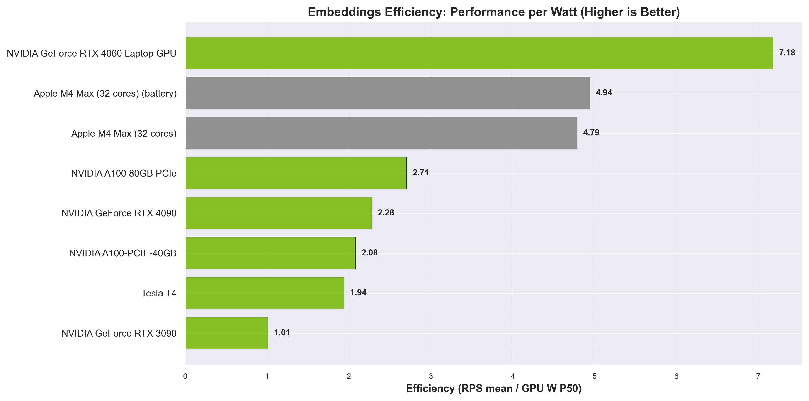
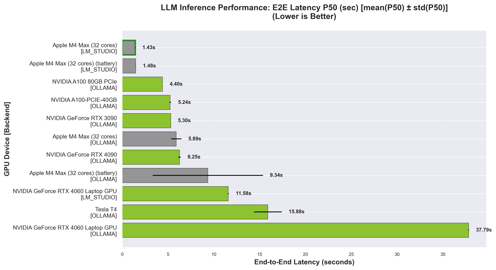
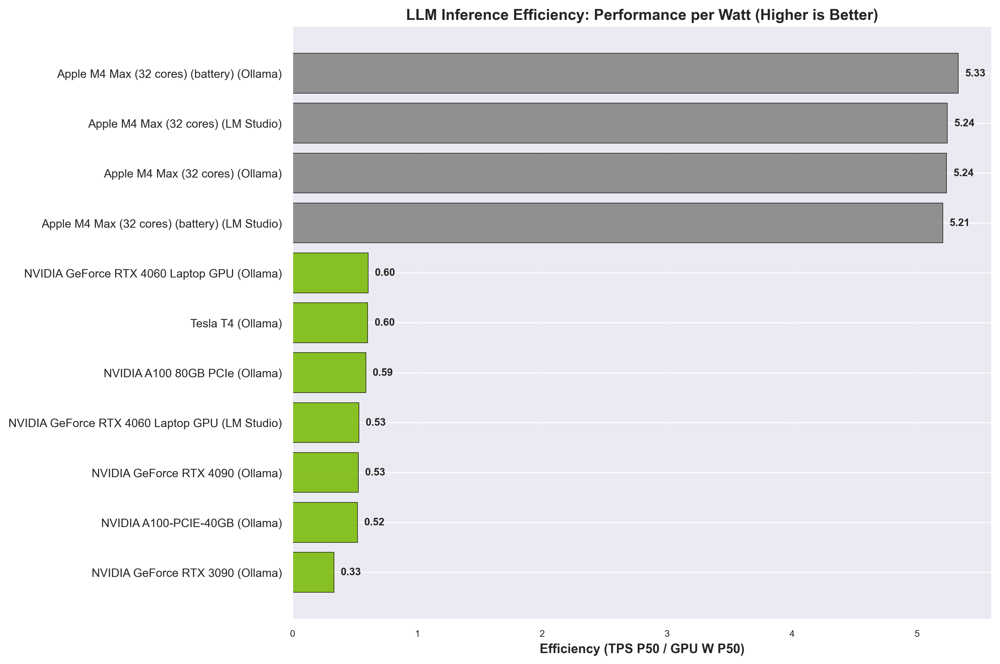
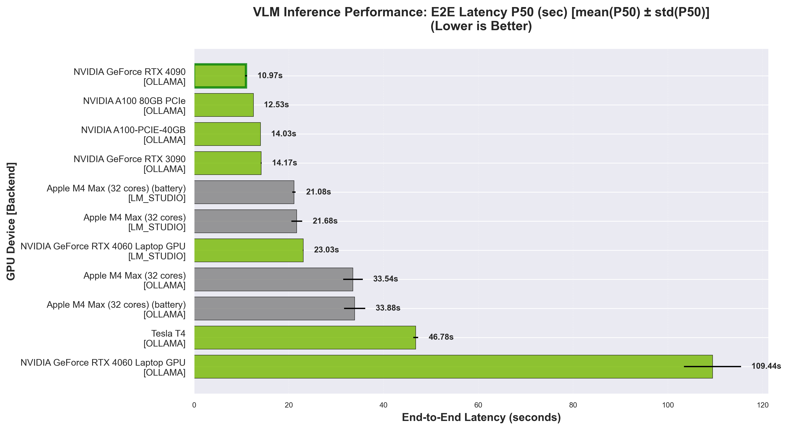
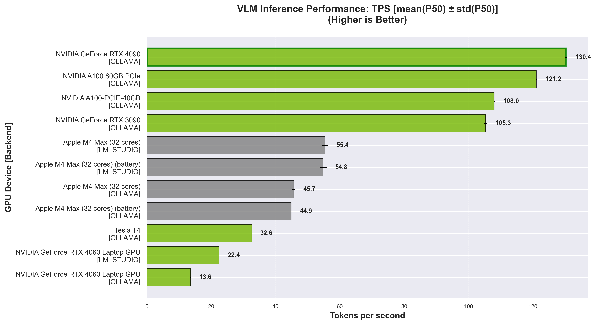
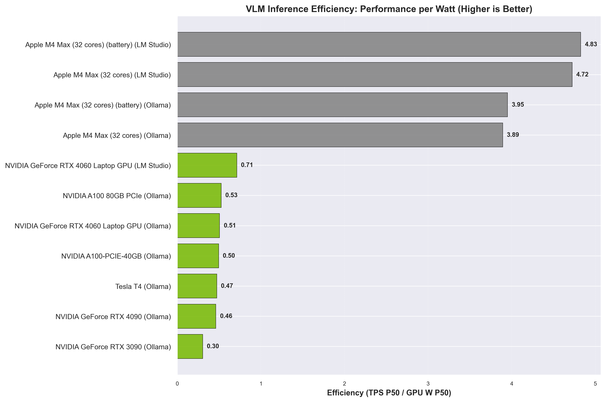

## Tasks
La Perf is a collection of reproducible tests and community-submitted results for :
- #### **Embeddings** — ✅ Ready (sentence-transformers, [IMDB dataset](https://huggingface.co/datasets/stanfordnlp/imdb))
   sts models:
   - [modernbert-embed-base](https://huggingface.co/nomic-ai/modernbert-embed-base)
- #### **LLM inference** — ✅ Ready (LM Studio and Ollama, [Awesome Prompts dataset](https://huggingface.co/datasets/fka/awesome-chatgpt-prompts))
   llm models:
   - **LM Studio**: [gpt-oss-20b](https://lmstudio.ai/models/openai/gpt-oss-20b)
     - *macOS*: `mlx-community/gpt-oss-20b-MXFP4-Q8` (MLX MXFP4-Q8)
     - *Other platforms*: `lmstudio-community/gpt-oss-20b-GGUF` (GGUF)
   - **Ollama**: [gpt-oss-20b](https://ollama.com/library/gpt-oss:20b)

- #### **VLM inference** — ✅ Ready (LM Studio and Ollama, [Hallucination_COCO dataset](https://huggingface.co/datasets/DogNeverSleep/Hallucination_COCO))
   vlm models:
   - **LM Studio**: Qwen3-VL-8B-Thinking
     - *macOS*: `mlx-community/Qwen3-VL-8B-Thinking-4bit` (MLX 4-bit)
     - *Other platforms*: `Qwen/Qwen3-VL-8B-Thinking-GGUF-Q4_K_M` (Q4_K_M)
   - **Ollama**: [qwen3-vl:8b](https://ollama.com/library/qwen3-vl:8b)
      - **all platforms**: `qwen3-vl:8b` (Q4_K_M)
- #### **Diffusion image generation** — 📋 Planned
- #### **Speach to Text** - 📋 Planned (whisper)
- #### **Classic ML** — 📋 Planned (scikit-learn, XGBoost, LightGBM, Catboost)

**Note For mac-users**: If it's possible prefer to use lmstudio with `mlx` backend, which gives 10-20% more performance then `gguf`. If you run ollama (by default benchmarks runs both lmstudio and ollama) then you'll see a difference between `mlx` and `gguf` formats.

The `MLX` backend makes the benchmark harder to maintain, but it provides a more realistic performance view, since it’s easy to convert a `safetensors` model into an `mlx` x-bit model.

## Benchmark Results

> **Last Updated**: 2025-11-19

| Device | Platform | CPU | GPU | VRAM | Emb RPS P50 | LLM TPS P50 (lms) | LLM TPS P50 (ollama) | VLM TPS P50 (lms) | VLM TPS P50 (ollama) | GPU Power P50 | CPU Power P50 | Emb Efficiency (RPS/W) | LLM Efficiency (TPS/W) lms | LLM Efficiency (TPS/W) ollama | VLM Efficiency (TPS/W) lms | VLM Efficiency (TPS/W) ollama |
|------|------|------|------|------|------|------|------|------|------|------|------|------|------|------|------|------|
| ASUSTeK COMPUTER ASUS Vivobook Pro N6506MV | 🐧 Linux | Intel(R) Core(TM) Ultra 9 185H (16) | NVIDIA GeForce RTX 4060 Laptop GPU | 8 GB | 119.1 | 8.8 | 10.0 | 11.8 | 8.4 | 16.6 W | - | 7.18 | 0.53 | 0.60 | 0.71 | 0.51 |
| Mac16,6 | 🍏 macOS | Apple M4 Max (14) | Apple M4 Max (32 cores) | shared with system RAM | 56.2 | 61.5 | 61.4 | 55.4 | 45.7 | 11.7 W | 1.0 W | 4.79 | 5.24 | 5.24 | 4.72 | 3.89 |
| Mac16,6 (battery) | 🍏 macOS | Apple M4 Max (14) (battery) | Apple M4 Max (32 cores) (battery) | shared with system RAM | 56.2 | 59.1 | 60.6 | 54.8 | 44.9 | 11.4 W | 1.0 W | 4.94 | 5.21 | 5.33 | 4.83 | 3.95 |
| OpenStack Nova 26.0.7-1 A100 40GB | 🐧 Linux | Intel(R) Xeon(R) Gold 6240R CPU @ 2.40GHz | NVIDIA A100-PCIE-40GB | 39 GB | 453.6 | - | 113.5 | - | 108.0 | 218.2 W | - | 2.08 | - | 0.52 | - | 0.50 |
| OpenStack Nova A100 80GB | 🐧 Linux | Intel Xeon Processor (Icelake) | NVIDIA A100 80GB PCIe | 79 GB | 623.8 | - | 135.5 | - | 121.2 | 230.5 W | - | 2.71 | - | 0.59 | - | 0.53 |
| OpenStack Nova RTX3090 | 🐧 Linux | Intel Xeon Processor (Cascadelake) | NVIDIA GeForce RTX 3090 | 24 GB | 349.5 | - | 114.8 | - | 105.3 | 345.6 W | - | 1.01 | - | 0.33 | - | 0.30 |
| OpenStack Nova RTX4090 | 🐧 Linux | Intel Xeon Processor (Icelake) | NVIDIA GeForce RTX 4090 | 24 GB | 643.6 | - | 148.7 | - | 130.4 | 282.5 W | - | 2.28 | - | 0.53 | - | 0.46 |
| OpenStack Nova Tesla T4 | 🐧 Linux | Intel Xeon Processor (Cascadelake) | Tesla T4 | 15 GB | 133.7 | - | 41.5 | - | 32.6 | 68.9 W | - | 1.94 | - | 0.60 | - | 0.47 |

*RPS - Requests Per Second (embeddings throughput)*

*TPS - Tokens Per Second (generation speed)*

*W - Watts (power consumption)*

*Efficiency metrics (RPS/W, TPS/W) are calculated using GPU power consumption*

### Power Metrics

| Device | CPU Usage (p50/p95) | RAM Used GB (p50/p95) | VRAM Used GB (p50/p95) | GPU Usage (p50/p95) | GPU Temp (p50/p95) | Battery (start/end/Δ) | Duration | GPU Power (p50/p95) | CPU Power (p50/p95) |
|------|------|------|------|------|------|------|------|------|------|
| ASUSTeK COMPUTER ASUS Vivobook Pro N6506MV | 35.6% / 43.4% | 12.3GB / 15.9GB | 7.1GB / 7.3GB | 12.0% / 32.0% | 56.0°C / 58.0°C | 100.0% / 100.0% / +0.0% | 3h 54m | 16.6W / 21.4W | N/A |
| Mac16,6 | 3.7% / 7.9% | 21.5GB / 24.3GB | 11.1GB / 14.4GB | 97.0% / 100.0% | N/A | 85% / 85% / +0.0% | 44m 29s | 11.7W / 33.4W | 1.0W / 2.3W |
| Mac16,6 (battery) | 3.7% / 8.0% | 19.9GB / 23.6GB | 10.6GB / 14.1GB | 97.0% / 100.0% | N/A | 85% / 19% / +66.0% | 48m 7s | 11.4W / 32.8W | 1.0W / 2.1W |
| OpenStack Nova 26.0.7-1 A100 40GB | 23.4% / 32.0% | 5.4GB / 6.2GB | 12.0GB / 13.6GB | 77.0% / 85.0% | 59.0°C / 66.0°C | N/A | 16m 44s | 218.2W / 256.2W | N/A |
| OpenStack Nova A100 80GB | 8.7% / 11.3% | 5.6GB / 6.3GB | 12.0GB / 13.6GB | 86.0% / 90.0% | 52.0°C / 55.0°C | N/A | 14m 38s | 230.5W / 274.4W | N/A |
| OpenStack Nova RTX3090 | 17.9% / 22.2% | 4.9GB / 5.6GB | 11.7GB / 13.2GB | 82.0% / 86.0% | 62.0°C / 62.0°C | N/A | 15m 10s | 345.6W / 348.7W | N/A |
| OpenStack Nova RTX4090 | 17.5% / 20.9% | 4.8GB / 5.6GB | 11.8GB / 13.5GB | 84.0% / 89.0% | 57.0°C / 60.0°C | N/A | 13m 12s | 282.5W / 331.8W | N/A |
| OpenStack Nova Tesla T4 | 14.7% / 16.7% | 3.8GB / 4.4GB | 10.7GB / 12.4GB | 95.0% / 96.0% | 49.0°C / 49.0°C | N/A | 44m 32s | 68.9W / 71.5W | N/A |

!!! Note

    For devices with unified memory (e.g. Apple Silicon), **VRAM usage** represents the portion of shared RAM allocated to the GPU — it does not indicate a separate dedicated memory pool as on discrete GPUs.

    **Duration** shows the total monitoring time during benchmark execution.

### Embeddings

#### Text Embeddings (3000 IMDB samples)

_RPS = Rows Per Second — number of text samples encoded per second._

| Device | Model | RPS (mean ± std) | Time (s) (mean ± std) | Embedding Dim | Batch Size |
|------|------|------|------|------|------|
| ASUSTeK COMPUTER ASUS Vivobook Pro N6506MV | nomic-ai/modernbert-embed-base | 119.14 ± 17.84 | 25.53 ± 3.52 | 768 | 32 |
| Mac16,6 | nomic-ai/modernbert-embed-base | 56.18 ± 0.78 | 53.41 ± 0.75 | 768 | 32 |
| Mac16,6 (battery) | nomic-ai/modernbert-embed-base | 56.17 ± 0.70 | 53.42 ± 0.66 | 768 | 32 |
| OpenStack Nova 26.0.7-1 A100 40GB | nomic-ai/modernbert-embed-base | 453.58 ± 2.09 | 6.61 ± 0.03 | 768 | 32 |
| OpenStack Nova A100 80GB | nomic-ai/modernbert-embed-base | 623.81 ± 1.30 | 4.81 ± 0.01 | 768 | 32 |
| OpenStack Nova RTX3090 | nomic-ai/modernbert-embed-base | 349.50 ± 0.97 | 8.58 ± 0.02 | 768 | 32 |
| OpenStack Nova RTX4090 | nomic-ai/modernbert-embed-base | 643.55 ± 2.16 | 4.66 ± 0.02 | 768 | 32 |
| OpenStack Nova Tesla T4 | nomic-ai/modernbert-embed-base | 133.71 ± 1.22 | 22.44 ± 0.20 | 768 | 32 |

*Throughput comparison for different embedding models across hardware. Higher values indicate better performance.*

*Embeddings efficiency (RPS/W) across devices. Higher values indicate better performance per watt.*

### LLMs

#### LLM Inference (10 prompts from awesome-chatgpt-prompts)

**LM STUDIO**

| Device | Model | TPS P50 | TPS P95 | TTFT P50 (s) | TTFT P95 (s) | TG P50 (s) | TG P95 (s) | Latency P50 (s) | Latency P95 (s) | Input Tokens (total avg) | Output Tokens (total avg) |
|------|------|------|------|------|------|------|------|------|------|------|------|
| ASUSTeK COMPUTER ASUS Vivobook Pro N6506MV | openai/gpt-oss-20b | 8.82 ± 0.05 | 9.18 ± 0.07 | 5.65 ± 0.10 | 12.21 ± 0.26 | 1.59 ± 0.01 | 142.55 ± 7.24 | 11.58 ± 0.05 | 149.31 ± 7.54 | 1728 | 4192 |
| Mac16,6 | openai/gpt-oss-20b | 61.51 ± 1.13 | 83.84 ± 2.98 | 0.88 ± 0.01 | 1.42 ± 0.02 | 0.26 ± 0.00 | 16.00 ± 0.57 | 1.43 ± 0.03 | 17.04 ± 0.60 | 1728 | 4459 |
| Mac16,6 (battery) | openai/gpt-oss-20b | 59.15 ± 1.41 | 77.72 ± 1.14 | 0.94 ± 0.02 | 1.47 ± 0.02 | 0.27 ± 0.00 | 17.39 ± 0.30 | 1.48 ± 0.04 | 18.50 ± 0.29 | 1728 | 4459 |

**OLLAMA**

| Device | Model | TPS P50 | TPS P95 | TTFT P50 (s) | TTFT P95 (s) | TG P50 (s) | TG P95 (s) | Latency P50 (s) | Latency P95 (s) | Input Tokens (total avg) | Output Tokens (total avg) |
|------|------|------|------|------|------|------|------|------|------|------|------|
| ASUSTeK COMPUTER ASUS Vivobook Pro N6506MV | gpt-oss:20b | 10.04 ± 0.05 | 10.17 ± 0.03 | 26.74 ± 0.20 | 92.85 ± 43.15 | 3.14 ± 0.10 | 120.19 ± 4.75 | 37.79 ± 0.04 | 187.28 ± 54.75 | 1728 | 7201 |
| Mac16,6 | gpt-oss:20b | 61.43 ± 6.28 | 65.10 ± 5.17 | 3.79 ± 0.55 | 18.84 ± 1.57 | 0.45 ± 0.03 | 24.20 ± 3.50 | 5.89 ± 0.56 | 39.85 ± 3.58 | 1728 | 8535 |
| Mac16,6 (battery) | gpt-oss:20b | 60.56 ± 6.81 | 64.23 ± 5.94 | 4.01 ± 0.80 | 42.93 ± 42.00 | 0.51 ± 0.11 | 24.65 ± 3.90 | 9.34 ± 6.01 | 59.53 ± 34.44 | 1728 | 11877 |
| OpenStack Nova 26.0.7-1 A100 40GB | gpt-oss:20b | 113.51 ± 1.74 | 119.83 ± 0.78 | 1.92 ± 0.01 | 31.23 ± 15.21 | 0.56 ± 0.00 | 11.08 ± 0.85 | 5.24 ± 0.09 | 35.87 ± 15.85 | 1728 | 13042 |
| OpenStack Nova A100 80GB | gpt-oss:20b | 135.49 ± 0.36 | 141.08 ± 0.38 | 1.58 ± 0.01 | 26.31 ± 12.50 | 0.48 ± 0.01 | 9.41 ± 0.67 | 4.40 ± 0.01 | 30.23 ± 12.96 | 1728 | 13042 |
| OpenStack Nova RTX3090 | gpt-oss:20b | 114.83 ± 0.13 | 119.78 ± 0.46 | 3.24 ± 0.03 | 9.86 ± 0.04 | 0.24 ± 0.00 | 10.64 ± 0.07 | 5.30 ± 0.01 | 19.43 ± 0.09 | 1728 | 8926 |
| OpenStack Nova RTX4090 | gpt-oss:20b | 148.69 ± 0.54 | 153.80 ± 0.24 | 2.69 ± 0.02 | 13.65 ± 0.04 | 0.26 ± 0.00 | 8.68 ± 0.03 | 6.25 ± 0.12 | 18.51 ± 0.08 | 1728 | 11979 |
| OpenStack Nova Tesla T4 | gpt-oss:20b | 41.49 ± 0.23 | 42.17 ± 0.07 | 13.07 ± 2.85 | 52.33 ± 15.42 | 0.85 ± 0.11 | 35.54 ± 4.21 | 15.88 ± 1.51 | 84.51 ± 10.32 | 1728 | 12683 |

*End-to-End Latency P50 - Lower is better. Measures full request-to-response time.*

*Token Generation per second (TPS) - Higher is better. Measures token generation speed.*

*LLM inference efficiency (TPS/W) by backend. Higher values indicate better performance per watt.*

### VLMs

#### VLM Inference (10 questions from Hallucination_COCO)

**LM STUDIO**

| Device | Model | TPS P50 | TPS P95 | TTFT P50 (s) | TTFT P95 (s) | TG P50 (s) | TG P95 (s) | Latency P50 (s) | Latency P95 (s) | Input Tokens (total avg) | Output Tokens (total avg) |
|------|------|------|------|------|------|------|------|------|------|------|------|
| ASUSTeK COMPUTER ASUS Vivobook Pro N6506MV | qwen3-vl-8b-thinking | 11.81 ± 0.04 | 12.01 ± 0.04 | 0.85 ± 0.06 | 1.02 ± 0.06 | 147.01 ± 0.75 | 174.51 ± 0.41 | 147.83 ± 0.79 | 175.48 ± 0.36 | 290 | 16709 |
| Mac16,6 | qwen3-vl-8b-thinking-mlx | 55.39 ± 0.96 | 56.20 ± 1.60 | 1.51 ± 0.02 | 1.65 ± 0.02 | 20.15 ± 1.15 | 24.70 ± 0.81 | 21.68 ± 1.14 | 26.29 ± 0.91 | 310 | 11899 |
| Mac16,6 (battery) | qwen3-vl-8b-thinking-mlx | 54.82 ± 1.12 | 55.60 ± 1.58 | 1.53 ± 0.02 | 1.66 ± 0.01 | 19.57 ± 0.35 | 29.45 ± 1.85 | 21.08 ± 0.33 | 31.03 ± 1.82 | 310 | 12377 |

**OLLAMA**

| Device | Model | TPS P50 | TPS P95 | TTFT P50 (s) | TTFT P95 (s) | TG P50 (s) | TG P95 (s) | Latency P50 (s) | Latency P95 (s) | Input Tokens (total avg) | Output Tokens (total avg) |
|------|------|------|------|------|------|------|------|------|------|------|------|
| ASUSTeK COMPUTER ASUS Vivobook Pro N6506MV | qwen3-vl:8b | 8.40 ± 0.13 | 8.87 ± 0.03 | 86.59 ± 7.58 | 117.63 ± 3.06 | 95.99 ± 2.91 | 136.66 ± 2.31 | 178.61 ± 12.51 | 244.59 ± 1.09 | 1814 | 14933 |
| Mac16,6 | qwen3-vl:8b | 45.66 ± 0.39 | 49.68 ± 6.80 | 15.68 ± 0.41 | 27.98 ± 0.55 | 16.31 ± 0.35 | 19.45 ± 1.09 | 33.54 ± 2.06 | 44.30 ± 0.94 | 1814 | 15577 |
| Mac16,6 (battery) | qwen3-vl:8b | 44.87 ± 0.09 | 49.33 ± 7.16 | 15.85 ± 0.47 | 28.47 ± 0.75 | 16.57 ± 0.33 | 19.74 ± 1.05 | 33.88 ± 2.23 | 45.10 ± 1.29 | 1814 | 15577 |
| OpenStack Nova 26.0.7-1 A100 40GB | qwen3-vl:8b | 108.03 ± 0.17 | 108.57 ± 0.57 | 7.09 ± 0.01 | 11.59 ± 0.70 | 6.97 ± 0.03 | 9.42 ± 0.01 | 14.03 ± 0.02 | 19.40 ± 0.46 | 1814 | 16212 |
| OpenStack Nova A100 80GB | qwen3-vl:8b | 121.16 ± 0.23 | 121.55 ± 0.26 | 6.26 ± 0.01 | 10.34 ± 0.70 | 6.25 ± 0.03 | 8.43 ± 0.02 | 12.53 ± 0.03 | 17.34 ± 0.52 | 1814 | 16212 |
| OpenStack Nova RTX3090 | qwen3-vl:8b | 105.30 ± 0.42 | 105.65 ± 0.28 | 7.44 ± 0.09 | 11.97 ± 0.06 | 7.59 ± 0.28 | 9.05 ± 0.02 | 14.17 ± 0.11 | 19.59 ± 0.06 | 1814 | 15940 |
| OpenStack Nova RTX4090 | qwen3-vl:8b | 130.42 ± 0.25 | 130.94 ± 0.22 | 5.53 ± 0.01 | 8.99 ± 0.01 | 5.85 ± 0.07 | 7.29 ± 0.01 | 10.97 ± 0.21 | 15.24 ± 0.03 | 1814 | 15258 |
| OpenStack Nova Tesla T4 | qwen3-vl:8b | 32.63 ± 0.01 | 32.74 ± 0.06 | 23.38 ± 0.04 | 32.20 ± 0.02 | 23.17 ± 0.10 | 32.79 ± 0.04 | 46.78 ± 0.51 | 63.59 ± 0.05 | 1814 | 15737 |

*End-to-End Latency P50 - Lower is better. Measures full request-to-response time.*

*Token Generation per second (TPS) - Higher is better. Measures token generation speed.*

*VLM inference efficiency (TPS/W) by backend. Higher values indicate better performance per watt.*

---
_All metrics are shown as mean ± standard deviation across 3 runs.
